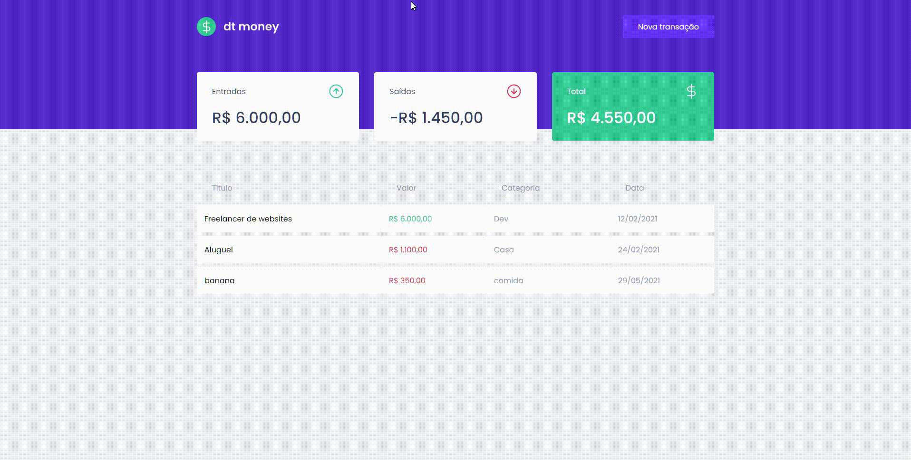

<h1> WatchMe </h1>

> Status: Developer ☝️

### Objetivo 
#### Nesse módulo do Ignite, foi desenvolvido uma aplicação financeira do total ZERO, priorizando padrões de formatação, [**useState**](https://pt-br.reactjs.org/docs/hooks-state.html), [**useEffect**](https://pt-br.reactjs.org/docs/hooks-effect.html) e entrando um pouco dentro da [**ContextAPI**](https://pt-br.reactjs.org/docs/context.html)  

 
  

### Sobre
<small> O DT Money, é um sistema para realizar anotações de saídas e entradas financeiras. O usuário vai em nova transação e será aberto um modal onde o mesmo poderá cadastrar seu tipo de transação, podendo ser de saída ou de entrada, além disso poderá colocar a sua respectiva categoria

</small>

### Técnicas

- [x] Componentes
- [x] Hooks
- [X] Consumo de Api (usando Axios e o Mirage) 
- [X] ContextAPI
- [X] Modal e Forms
- [X] Styled-components

## Rodar o Projeto

#### `yarn start`
Ao abrir o projeto dentro do seu editor de código

 
  <small> Josileudo Rodrigues - 2021</small>
</div
